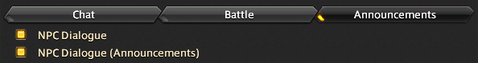
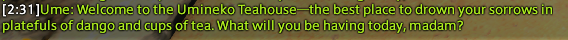

# Quest TTS

This plugin reads the NPC chat and reads it back to you through google translate. The text will only be read after the speach bubble has been closed due to how the text appears in the chat.

### Install
1. Place the folder questTTS in cactbot/ui
2. Create a new custom Overlay with the type label
3. Change the url to the questTTS.html

### Setup
Go to your options and activate the following in any chat tab:  

Example of NPC text:  

Audio:  
https://youtu.be/f1yjO7hBcx8
